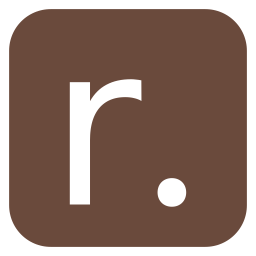

# r.obin.ch

Feel free to checkout how the website was built and reuse its code, but please don't copy the content, design and brand.

## License

- **Code**: See [license file](./LICENSE)
- **Content, Media, Design, ..**: CC BY-NC-ND 4.0   
