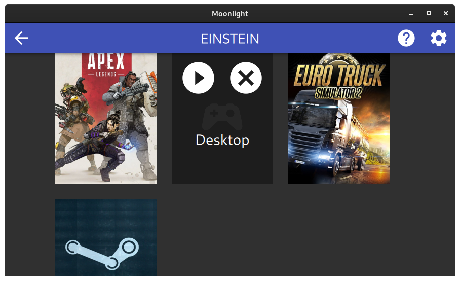

Fast ein ganzes Jahr durfte ich in der Beta von [Nvidias GeForce Now](https://www.nvidia.com/en-eu/geforce-now/) das Angebot kostenlos testen. Daran gefällt mir sehr, dass ich die Spiele, welche ich bereits besass mitbringen konnte und so nicht doppelt kaufen oder mieten musste. Dabei konnten vorgefertigte, virtuelle Maschinen mit vorinstallierten Spielen benutzt oder eigenhändig nachinstalliert werden. Das individuelle Installieren von Spielen wurde leider später entfernt. Auch haben einige Spielepublisher Nvidia die [Berechtigung entzogen ihre Spiele](https://www.theverge.com/2020/5/27/21272558/nvidia-geforce-now-opt-in-agreement-game-developers-publishers-licensing-cloud-gaming) anzubieten. Die unterstützten Spiel liefen oftmals ohne Probleme. Es hat Spass gemacht, so ganz ohne Spielerechner zu zocken. Vor allem als Gelegenheitsspieler mit geeignetem Breitbandanschluss ist GeForce Now auch heute ein tolles Angebot, wenn den die geforderten Spiele unterstützt werden.

Auch für Videobearbeitung, 3d-Modellierung oder um das eine oder andere Programm zu kompilieren ist ein leistungsstarker Rechner nützlich. Was für anspruchsvolle geeignet ist, sollte auch dafür gut funktionieren, dachte ich mir. Bei Nvidia werden die virtuellen Maschinen nach jedem gebrauchen zurückgesetzt und wie schon erwähnt, war es irgendwann nicht mehr möglich individuelle Software zu installieren. [Shadow](https://shadow.tech) bietet genau das an. Eine eigene virtuelle Maschine mit Windows 10 auf der alles nach belieben installiert und eingerichtet werden kann. Nach einer langen Wartefrist konnte ich da erfolgreich einige Videos schneiden, 3d-Modelle gestalten und auch das eine oder andere Spiel spielen. Vor allem bei anspruchsvollen Aufgaben fehlte es aber da an Leistung. Auch wurde vor [kurzem der Preis fast verdoppelt](https://shadow.tech/blog/teamshadow/introducing-our-new-offer) bei gleichbleibender Leistung.

Shadow konnte ich auch über Android TV benutzen und die Integration von Gamecontroller hat immer tadellos funktioniert. Meine [Nvidia Shield TV Pro Box](https://www.nvidia.com/en-us/shield/shield-tv-pro/) mit der Shadow App hat einfach alles an Gamecontrollern akzeptiert was da angeschlossen wurde. Seien es XBox- oder Playstation-Kontroller gewesen, ob über USB oder Bluetooth, war nie ein Problem. Auch der vorhandene [Linux Client für Shadow](https://aur.archlinux.org/packages/shadow-tech/) war minimalistisch und hat immer das gemacht, was er sollte. Irgendwann hat aber da die Leistung nicht mehr gereicht und ein eigener Rechner bietet einfach schon noch etwas mehr Flexibilität.

## Ersatz für GeForce Now und Shadow

Irgendwann habe ich mir dann doch wieder einen leistungsstarker Desktopcomputer gekauft. Gerade noch so, bevor die Grafikkarten und anderen Komponenten wirklich fast unbezahlbar wurden. Um jetzt weiterhin auf dem Sofa die eine oder andere Runde zu spielen habe ich zwei Lösungen gefunden:

1. Über [Steam Link](https://store.steampowered.com/app/353380/Steam_Link/), wofür es auch eine [App für Android TV](https://play.google.com/store/apps/details?id=com.valvesoftware.steamlink&hl=en&gl=US) und somit Shield TV gibt.
1. Oder mittels Nvidias GeForce Experience, worin auch die Möglichkeit integriert ist zu Shield TV zu streamen.

Aus folgenden Gründen habe ich mich schlussendlich für die Nvidias Lösung entschieden, weil:

- .. auf der Shield TV Box keine zusätzlichen Apps notwendig sind.
- .. auch der gesamte Desktop gestreamt werden kann und auch andere Applikationen ohne grössere Bastelei integriert werden können.
- .. es einen schlanken quelloffenen Client mit QT Oberfläche und in 64-Bit gibt, welcher praktisch auf jeder Plattform funktioniert.

## Nvidia Gamestream und Moonlight einrichten

Den Host unter Windows 10 einzurichten ist denkbar einfach. Dazu muss [GeForce Experience](https://www.nvidia.com/en-us/geforce/geforce-experience/) installiert werden. Danach kann in den Einstellungen unter Shield Gamestream aktiviert werden.

In Shield TV kann im Menü nun der Computer für Gamestream verbunden werden. Dazu muss ein Bestätigungscode am Hostrechner eingegeben werden.

Auf anderen Systemen ist der Zugriff auch sehr einfach möglich. Dazu verwende ich die quelloffene Software "[Moonlight](https://moonlight-stream.org/)". Für Arch Linux gibt es [die Software über AUR](https://aur.archlinux.org/packages/moonlight-qt/). Beispielsweise kann so Moonlight mit `yay` installiert werden: `yay -S moonlight-qt`. Ist der Client im selben Netz wie der Host sollten diese sich gegenseitig finden. Es muss nochmal ein Bestätigungscode vom Client auf dem Host eingegeben werden.

Nachdem die Verbindung zum Host aufgebaut werden konnte erscheint eine Auswahl mit Apps und Spielen. Von da könnte Steam und dessen Big Picture Modus gestartet werden.

In den Einstellungen kann einiges angepasst werden. Bspw. wie stark das übertragene Bild komprimiert werden soll. Bei mir hat alles auf Anhieb funktioniert, inklusive Audio in beide Richtungen.

## Desktop via Nvidia Gamestream übertragen

In den FAQ von Moonlight wird auch [verraten](https://github.com/moonlight-stream/moonlight-docs/wiki/Setup-Guide#using-moonlight-to-stream-your-entire-desktop) wie der gesamte Desktop gestreamt werden kann. Dazu wird in GeForce Experience eine neue App hinzugefügt, welche `C:\Windows\System32\mstsc.exe` benutzt.

Mit <kbd>CTRL</kbd>-<kbd>SHIFT</kbd>-<kbd>ALT</kbd>-<kbd>Q</kbd> kann der Stream wieder verlassen werden. Der Mauszeiger kann mit <kbd>CTRL</kbd>-<kbd>SHIFT</kbd>-<kbd>ALT</kbd>-<kbd>TAB</kbd> unter Gnome wieder befreit werden.

Den Rechner kann ich nun in die Besenkammer sperren und habe dennoch ohne Lüftergeräusche viel Rechenleistung im gesamten Netzwerk zur Verfügung. Auch aus der Entfernung übers Internet konnte in den Rechner noch erfolgreich nutzen, allerdings ohne VPN.
