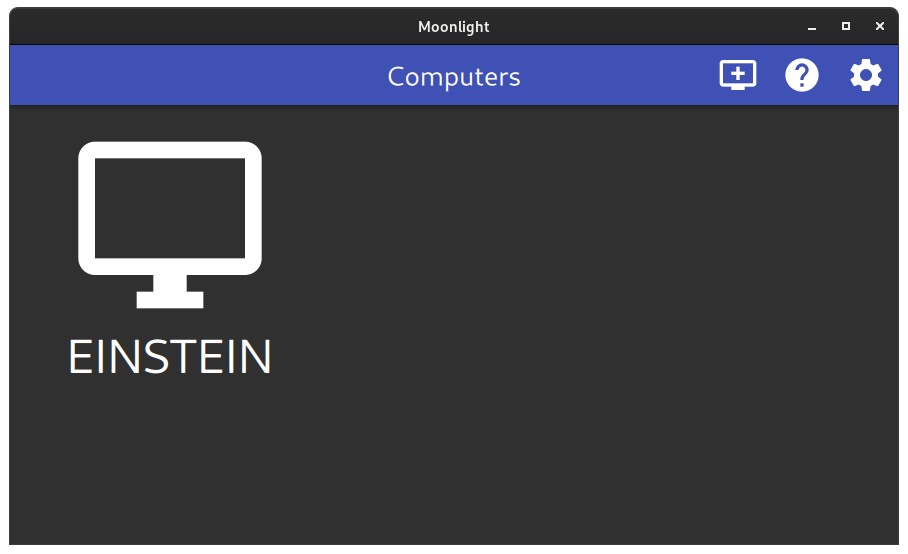
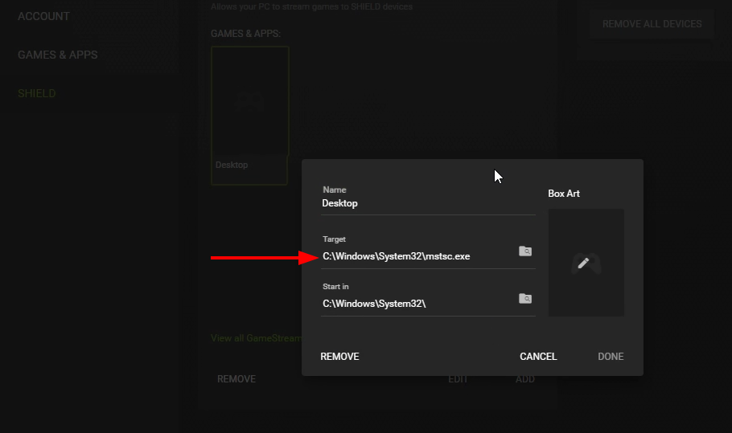

For almost a whole year I was allowed to test the beta of [Nvidias GeForce Now](https://www.nvidia.com/en-eu/geforce-now/) for free. I really liked the fact that I could bring the games I already owned with me and didn't have to buy or rent them twice. I could use pre-built virtual machines with pre-installed games or install them myself. The individual installation of games was unfortunately removed later. Also, some game publishers withdrew the [permission to offer their games](https://www.theverge.com/2020/5/27/21272558/nvidia-geforce-now-opt-in-agreement-game-developers-publishers-licensing-cloud-gaming) from Nvidia. The supported games often ran without problems. It was fun to gamble without a gaming computer at all. Especially as a casual gamer with a suitable broadband connection, GeForce Now is still a great offer today if the required games are supported.

A powerful computer is also useful for video editing, 3d modeling or to compile the one or other program. What is suitable for demanding should also work well for it, I thought. With Nvidia the virtual machines are reset after each use and as already mentioned, at some point it was no longer possible to install individual software. [Shadow](https://shadow.tech) offers exactly that. An own virtual machine with Windows 10 on which everything can be installed and set up as desired. After a long waiting period, I was able to successfully cut some videos, design 3d models and also play the one or other game. However, it lacked performance, especially when it came to demanding tasks. Also [recently the price was almost doubled](https://shadow.tech/blog/teamshadow/introducing-our-new-offer) with the same performance.

I could also use Shadow via Android TV and the integration of game controllers always worked flawlessly. My [Nvidia Shield TV Pro Box](https://www.nvidia.com/en-us/shield/shield-tv-pro/) with the Shadow app just accepted whatever game controllers were plugged into it. Be it XBox or Playstation controllers, whether via USB or Bluetooth, was never a problem. Also the existing [Linux Client for Shadow](https://aur.archlinux.org/packages/shadow-tech/) was minimalistic and always did what it was supposed to do. At some point, however, the performance was no longer enough and a separate computer simply offers a bit more flexibility.

## Replacement for GeForce Now and Shadow

At some point I bought a powerful desktop computer again. Just before the graphics cards and other components really became almost unaffordable. In order to continue to play the one or other round on the sofa I found two solutions:

1. via [Steam Link](https://store.steampowered.com/app/353380/Steam_Link/), for which there is also an [App for Android TV](https://play.google.com/store/apps/details?id=com.valvesoftware.steamlink&hl=en&gl=US) and thus Shield TV.
1. or via Nvidia's GeForce Experience, which also includes the option to stream to Shield TV.

For the following reasons, I finally decided on the Nvidias solution, because:

- ... no additional apps are necessary on the Shield TV box.
- ... the entire desktop can also be streamed and other apps can be integrated without major tinkering.
- ... there is a slim open source client with QT interface and in 64-bit, which works practically on every platform.

## Setting up Nvidia Gamestream and Moonlight

Setting up the host under Windows 10 is very simple. For this, [GeForce Experience](https://www.nvidia.com/en-us/geforce/geforce-experience/) has to be installed. After that, Gamestream can be activated in the settings under Shield.

In Shield TV, the computer can now be connected for Gamestream in the menu. To do this, a confirmation code must be entered on the host computer.

On other systems the access is also very easy. For this I use the open source software "[Moonlight](https://moonlight-stream.org/)". For Arch Linux there is [the software via AUR](https://aur.archlinux.org/packages/moonlight-qt/). For example you can install Moonlight with `yay`: `yay -S moonlight-qt`. If the client is in the same network as the host, they should find each other. You have to enter a confirmation code from the client on the host again.

After the connection to the host could be established a selection with apps and games appears. From there Steam and its Big Picture mode could be started.

In the settings some things can be adjusted. For example, how much the transmitted image should be compressed. For me everything worked right away, including audio in both directions.

## Transfer desktop via Nvidia Gamestream

In the FAQ of Moonlight it is also [revealed](https://github.com/moonlight-stream/moonlight-docs/wiki/Setup-Guide#using-moonlight-to-stream-your-entire-desktop) how the whole desktop can be streamed. For this, a new app is added in GeForce Experience, which uses `C:\Windows\System32\mstsc.exe`.

With <kbd>CTRL</kbd>-<kbd>SHIFT</kbd>-<kbd>ALT</kbd>-<kbd>Q</kbd> the stream can be left again. The mouse pointer can be freed with <kbd>CTRL</kbd>-<kbd>SHIFT</kbd>-<kbd>ALT</kbd>-<kbd>TAB</kbd> under Gnome again.

I can now lock the computer in the broom closet and still have plenty of processing power available across the network without fan noise. Even from a distance over the Internet I could still use the computer successfully, but without VPN.

On other systems the access is also very easy. For this I use the open source software "[Moonlight](https://moonlight-stream.org/)". For Arch Linux there is [the software via AUR](https://aur.archlinux.org/packages/moonlight-qt/). For example you can install Moonlight with `yay`: `yay -S moonlight-qt`. If the client is in the same network as the host, they should find each other. You have to enter a confirmation code from the client on the host again.

After the connection to the host could be established a selection with apps and games appears. From there Steam and its Big Picture mode could be started.

In the settings some things can be adjusted. For example, how much the transmitted image should be compressed. For me everything worked right away, including audio in both directions.

## Transfer desktop via Nvidia Gamestream

In the FAQ of Moonlight it is also [revealed](https://github.com/moonlight-stream/moonlight-docs/wiki/Setup-Guide#using-moonlight-to-stream-your-entire-desktop) how the whole desktop can be streamed. For this, a new app is added in GeForce Experience, which uses `C:\Windows\System32\mstsc.exe`.

With <kbd>CTRL</kbd>-<kbd>SHIFT</kbd>-<kbd>ALT</kbd>-<kbd>Q</kbd> the stream can be left again. The mouse pointer can be freed with <kbd>CTRL</kbd>-<kbd>SHIFT</kbd>-<kbd>ALT</kbd>-<kbd>TAB</kbd> under Gnome again.

I can now lock the computer in the broom closet and still have plenty of processing power available across the network without fan noise. Even from a distance over the Internet I could still use the computer successfully, but without VPN.
