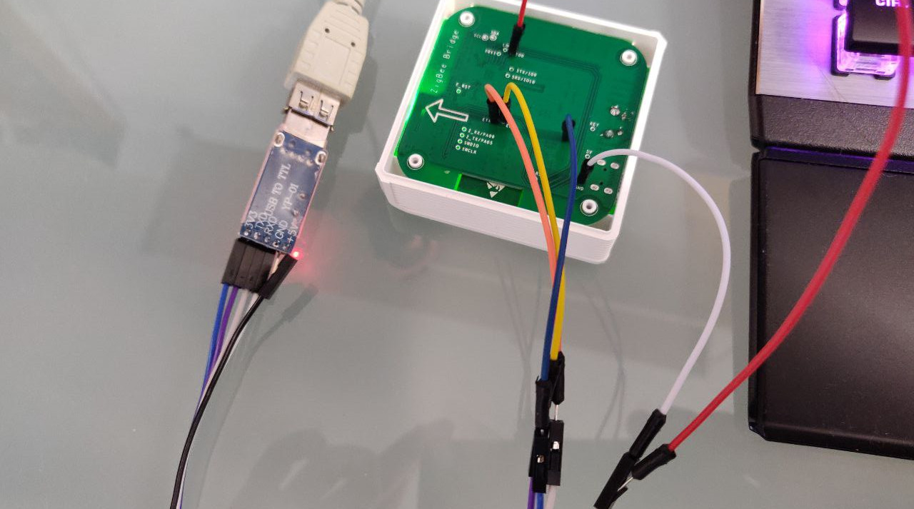

Zigbee hat sich in den letzten Jahren zum Funkstandard von Geräten zur Heimautomatisierung gemausert. Hersteller wie [IKEA](https://www.ikea.com) mit TRÅDFRI oder [Philips](https://www.philips.com) mit Hue setzen auf diesem Standard auf. Jeder dieser Hersteller hat damit ein eigenes Ökosystem von Produkten geschaffen. Home Assistant ist eine quelloffene Applikation, welche versucht möglichst viele solcher smarten Ökosysteme zu verknüpfen.

Das tolle daran ist, dass sich die meisten Systeme wirklich gut in Home Assistant integrieren lassen, denn [Zigbee](https://en.wikipedia.org/wiki/Zigbee) ist ein offener globaler Standard, welche auf IEEE 802.15.4 aufbaut. Alternativ zu Zigbee gibt es [Z-Wave](https://www.z-wave.com), jedoch wird dies hauptsächlich von einer einzelnen Firma vorangetrieben. Es gibt keine Produktevielfalt wie in der Welt von Zigbee. Weiter gibt es folgende Unterschiede:

|                | Zigbee                          | Z-Wave      |
| -------------- | ------------------------------- | ----------- |
| Frequenz       | 2.4GHz                          | ~800-900MHz |
| Reaktionszeit  | Schneller                       | Langsamer   |
| Energieaufwand | Höher                           | Geringer    |
| Netzwerkgrösse | Erweiterbar dank Mesh-Fähigkeit | Kleiner     |

Damit Zigbee Geräte in Home Assistant einzubinden wird ein Verbindungsstück zwischen Internetprotokoll (IP) und Zigbee benötigt, wie beispielsweise die [Sonoff Zigbee Bridge](https://sonoff.tech/product/smart-home-security/zbbridge/). Beim Händler aus Fernost [des Vertrauens](https://www.banggood.com/SONOFF-ZBBridge-Smart-Bridge-Zigbee3_0-APP-Wireless-Remote-Controller-Smart-Home-Bridge-Works-With-Alexa-Google-Home-p-1674754.html?cur_warehouse=CN&rmmds=search), gibt es sie um ca. CHF 20.00, jedoch können die Produkte von Sonoff zu einem ähnlichen Preis mittlerweile auch in bei [lokalen Händlern](https://www.digitec.ch/de/s1/product/sonoff-zigbee-bridge-netzwerk-zubehoer-15992012) gekauft werden.

## Sonoff Zigbee Bridge mit Tasmota bespielen

Um die Sonoff Zigbee Bridge mit Home Assistant benutzen zu können, muss die Firmware auf dem Gerät mit [Tasmota](https://tasmota.github.io/docs/) ersetzt werden. Dazu gibt es verschiedene [gute Anleitungen](https://www.digiblur.com/2020/07/how-to-use-sonoff-zigbee-bridge-with.html). Benötigt wird ein Schraubenzieher, [USB RS232 Adapter](https://www.banggood.com/Geekcreit-PL2303-USB-To-RS232-TTL-Converter-Adapter-Module-with-Dust-proof-Cover-PL2303HX-p-1536691.html) mit 3.3 Volt und ein paar Jumperkabel.

Unter den kleinen Gummifüsschen - die am besten direkt daneben in die Ecken geklebt werden - befinden sich vier Philipsschrauben. Danach können folgende Verbindungen zwischen der Leiterplatte und dem RS232 Adapter hergestellt werden:

| Sonoff Leiterplatte | RS232 Adapter |
| ------------------- | ------------- |
| GND                 | GND           |
| IO0 (GPIO 0)        | GND           |
| ETX                 | RX            |
| ERX                 | TX            |
| 3V3                 | 3V3           |

Mit [Tasmotizer](https://github.com/tasmota/tasmotizer) können wir nun die Firmware auf der Bridge mit Tasmota ersetzen. Dazu wird der passende Port - hier `ttyUSB0` - und das Image `tasmota-zbbridge.bin`, sowie `Erase beforeflashing`. Zudem ist es empfohlen ein Backup von der aktuellen Firmware zu erstellen. So könnte im Fall der Fälle, dass Etwas schief geht, der Originalzustand wieder hergestellt werden.

Die Sonoff Bridge kann nach erfolgreichem übertragen der Firmware vom USB-Adapter abgehängt werden und über den normalen Stromanschluss (Micro USB) wieder mit Strom versorgt werden.

Nach dem Start sollte die Bridge ein WLAN AP mit dem Namen `tasmota` gefolgt von einer vierstelligen Zahl zur Verfügung stellen. Damit kann man sich nun verbinden und im Browser `192.168.4.1` aufrufen, um die Bridge mit dem eigenen WLAN zu verbinden. Über den Router kann herausgefunden werden, welche IP-Adresse sich die Bridge zieht nach einem Neustart.

## Tasmota konfigurieren

Wieder über den Browser ruft man die neue IP-Adresse der mit Tasmota bespielten Bridge auf. Es erscheint ein Menü, worüber die `Console` aufgerufen werden kann.

Über die Konsole kann nun folgendes konfiguriert werden:

    Backlog Weblog 3; so65 1; Module 75

Nach einem weiteren Neustart soll die Zigbee Chipset Firmware aktualisiert werden. Die Firmware [ncp-uart-sw_6.7.8_115200.ota](https://github.com/arendst/Tasmota/tree/development/tools/fw_SonoffZigbeeBridge_ezsp) kann über `Firmware Upgrade` im Hauptmenü von Tasmota hochgeladen werden.

Erneut startet die Bridge neu. In der Konsole sollte mit der Nachricht `Zigbee started` ersichtlich sein, dass die Firmware erfolgreich aktualisiert wurde und Zigbee nun einsatzbereit ist.

Nun gilt es noch den TCP Server worüber Home Assistant mit der Bridge verbindet, zu konfigurieren. Dazu geben wir in der Konsole folgende Zeile ein:

    backlog rule1 on system#boot do TCPStart 8888 endon ; rule1 1 ; template {"NAME":"Sonoff ZHABridge","GPIO":[56,208,0,209,59,58,0,0,0,0,0,0,17],"FLAG":0,"BASE":18} ; module 0

Zuletzt soll noch die Adresse für die Over-the-Air Updates aktualisiert werden. Dazu wird in der Konsole eingegeben:

    otaurl http://ota.tasmota.com/tasmota/tasmota-zbbridge.bin.gz

## Home Assistant mit der Zigbee Bridge verbinden

In Home Assistant kann nun eine neue Integration `Zigbee Home Automation` erfasst werden. Mit einer manuellen Konfiguration soll der Radiotyp auf `EZSP` konfiguriert werden. Der Pfad lautet `socket://[Ip-Adresse]:8888` mit einem Port Speed von `115200`.

Nun können darüber Geräte verbunden werden.
