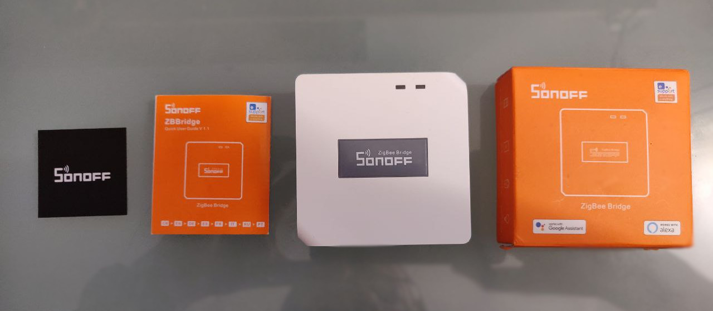
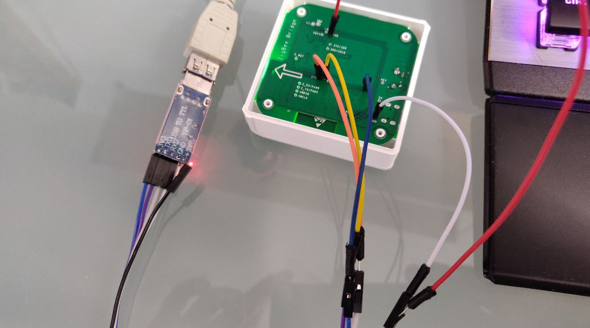
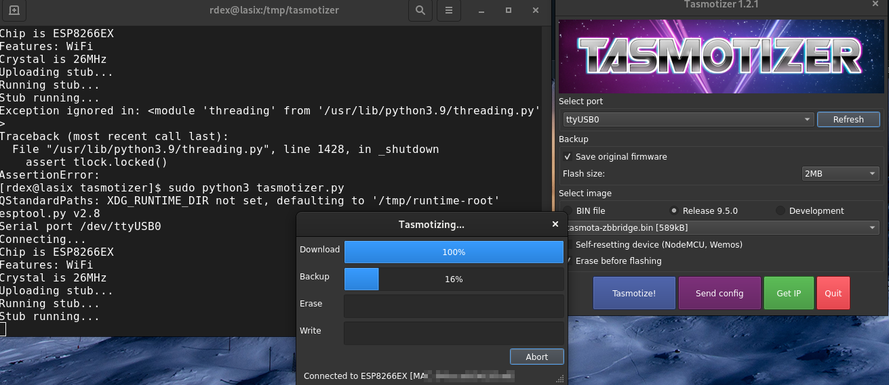

Zigbee has become the radio standard for home automation devices in recent years. Manufacturers like [IKEA](https://www.ikea.com) with TRÅDFRI or [Philips](https://www.philips.com) with Hue rely on this standard. Each of these manufacturers has created its own ecosystem of products with it. Home Assistant is an open source application that tries to link as many such smart ecosystems as possible.

The great thing is that most systems integrate really well with Home Assistant, because [Zigbee](https://en.wikipedia.org/wiki/Zigbee) is an open global standard based on IEEE 802.15.4. As an alternative to Zigbee, there is [Z-Wave](https://www.z-wave.com), but this is mainly driven by a single company. There is no product diversity as in the world of Zigbee. There are also the following differences:

|                   | Zigbee                               | Z-Wave      |
| ----------------- | ------------------------------------ | ----------- |
| Frequency         | 2.4GHz                               | ~800-900MHz |
| Response Time     | Faster                               | Slower      |
| Power consumption | Higher                               | Lower       |
| Network size      | Expandable thanks to mesh capability | Smaller     |

To integrate Zigbee devices into Home Assistant, a connector between Internet Protocol (IP) and Zigbee is needed, such as the [Sonoff Zigbee Bridge](https://sonoff.tech/product/smart-home-security/zbbridge/). You can buy it for about CHF 20.00 from a dealer in the Far East (https://www.banggood.com/SONOFF-ZBBridge-Smart-Bridge-Zigbee3_0-APP-Wireless-Remote-Controller-Smart-Home-Bridge-Works-With-Alexa-Google-Home-p-1674754.html?cur_warehouse=CN&rmmds=search), but Sonoff products can now also be bought at a similar price from [local dealers](https://www.digitec.ch/de/s1/product/sonoff-zigbee-bridge-netzwerk-zubehoer-15992012).

## Sonoff Zigbee Bridge with Tasmota

To use the Sonoff Zigbee Bridge with Home Assistant, the firmware on the device must be replaced with [Tasmota](https://tasmota.github.io/docs/). There are several [good instructions](https://www.digiblur.com/2020/07/how-to-use-sonoff-zigbee-bridge-with.html) for this. You need a screwdriver, [USB RS232 Adapter](https://www.banggood.com/Geekcreit-PL2303-USB-To-RS232-TTL-Converter-Adapter-Module-with-Dust-proof-Cover-PL2303HX-p-1536691.html) with 3.3 volts and some jumper cables.

USB RS232 adapter](usbrs232-adapter.jpg)

Underneath the little rubber feet - which are best stuck right next to them in the corners - there are four Philips screws. After that, the following connections can be made between the PCB and the RS232 adapter:

| Sonoff PCB   | RS232 Adapter |
| ------------ | ------------- |
| GND          | GND           |
| IO0 (GPIO 0) | GND           |
| ETX          | RX            |
| ERX          | TX            |
| 3V3          | 3V3           |

With [Tasmotizer](https://github.com/tasmota/tasmotizer) we can now replace the firmware on the bridge with Tasmota. This requires the appropriate port - here `ttyUSB0` - and the image `tasmota-zbbridge.bin`, as well as `Erase beforeflashing`. It is also recommended to make a backup of the current firmware. This way, in case something goes wrong, the original state could be restored.

After successfully transferring the firmware, the Sonoff Bridge can be disconnected from the USB adapter and powered up again via the normal power connection (Micro USB).

After starting, the bridge should provide a WLAN AP with the name 'tasmota' followed by a four-digit number. You can now connect to this and call up '192.168.4.1' in the browser to connect the bridge to your WLAN. You can find out via the router which IP address the bridge is pulling after a reboot.

## Configure Tasmota

Again via the browser, call up the new IP address of the bridge recorded with Tasmota. A menu appears via which the 'Console' can be called up.

The following can now be configured via the console:

    Backlog Weblog 3; so65 1; Module 75

After another reboot, the Zigbee chipset firmware should be updated. The firmware [ncp-uart-sw_6.7.8_115200.ota](https://github.com/arendst/Tasmota/tree/development/tools/fw_SonoffZigbeeBridge_ezsp) can be uploaded via `Firmware Upgrade` in the main menu of Tasmota.

Again, restart the bridge. The console should show the message 'Zigbee started', indicating that the firmware has been successfully upgraded and Zigbee is now ready for use.

Now we need to configure the TCP server that Home Assistant uses to connect to the bridge. To do this, we enter the following line in the console:

    backlog rule1 on system#boot do TCPStart 8888 endon ; rule1 1 ; template {"NAME": "Sonoff ZHABridge", "GPIO":[56,208,0,209,59,58,0,0,0,0,17], "FLAG":0, "BASE":18} ; module 0

Finally, the address for the over-the-air updates is to be updated. To do this, enter the following in the console

    otaurl http://ota.tasmota.com/tasmota/tasmota-zbbridge.bin.gz

## Connect Home Assistant with the Zigbee Bridge

In Home Assistant, a new integration 'Zigbee Home Automation' can now be entered. With a manual configuration, the radio type is to be configured to `EZSP`. The path is `socket://[Ip address]:8888` with a port speed of `115200`.

Now devices can be connected via it.
