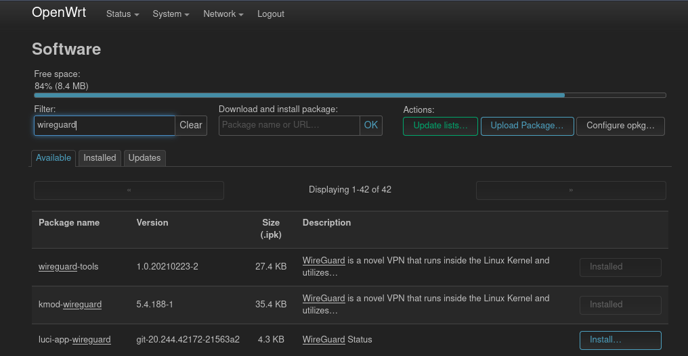

Wireguard offers a modern implementation of a virtual private network (VPN) and it can be easily set up on a OpenWrt router. The following covers the steps for doing so. In OpenWrts Wiki is [this](https://openwrt.org/docs/guide-user/services/vpn/wireguard/basics) page, which gives also some hints how to set it up.

# Install packages

After login in into OpenWrts administrator interface LuCI the packages `luci-proto-wireguard` and `luci-app-wireguard` need to be installed. For `luci-app-wireguard` a language package needs to be installed as well. Otherwise the `Wireguard` page won't show up in the `Status` menu. In my case I've installed `luci-i18n-wireguard-en`. The installation of the mentioned packages can be done via the main menu `System` and its entry `Software`. The first one adds the possibility to configure Wireguard interfaces and the other one adds an information page to the administration panel.



# Configure the Wireguard interface

To be able to configure the Wireguard interface the network service needs to be restarted, so it picks up the newly installed protocol from `lucy-proto-wireguard`. This can be done via the `Startup` page in the `System` menu. There you find the `network` service, which should be restarted.

Now it's time to create a new network interface for the VPN. A new interface can be created with the button at the bottom on the `Network / Interfaces` page. First a name for the interface should be picked. `vpn` should do the job. For the protocol we choose `Wireguard VPN`.


In the next form, the private key, from which the peers public keys will be derived, can be generated. As in most public networks not all ports are permitted, I usually choose 443 as this is usually open for HTTPS traffic. Last the ip addresses of this interface should be configured.


# Add peers

With the private key and the `wireguard-tools` the public key is generated:

```
echo "oKhIaA9iS2T89a9hnwMdfv2AXL8TIyU/rcEVo=" | wg pubkey
```
