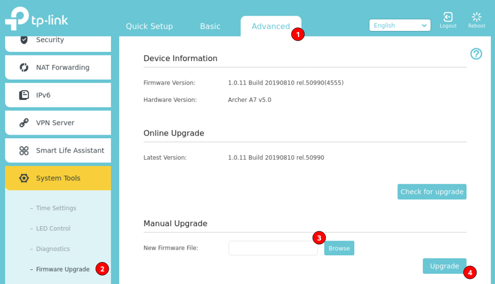

Um wirklich jede Ecke in der Wohnung angemessen mit WLAN zu bestrahlen, soll ein weiterer WLAN AP in Betrieb genommen werden. Zusätzlich möchte ich von der [Tomato Firmware](<https://en.wikipedia.org/wiki/Tomato_(firmware)>) auf [OpenWrt](https://openwrt.org/) wechseln, da OpenWrt aktueller und mit mehr Möglichkeiten durch die einzelnen Pakete daher kommt.

Die [Wikiseite zum Archer A7](https://openwrt.org/toh/tp-link/archer_a7_v5) von OpenWrt enthält ein Abbild welches über die Weboberfläche des Routers installiert werden kann. Folgende Schritte habe ich befolgt:

1. Router mit Strom versorgen
1. Computer an einem der Ethernetanschlüsse anschliessen
1. `http://192.168.0.1` im Browser aufrufen
1. Administrator Passwort des Routers setzen
1. Auf die Seite `Advanced > System Tools > Firmware Upgrade` navigieren
1. Firmwaredatei von der Wikiseite des Routers auswählen   
1. Nach einigen Minuten kann die Weboberfläche Luci von OpenWrt via `http://192.168.1.1` aufgerufen werden. Möglicherweise muss eine neue Zuweisung vom DHCP-Server angefordert werden.
