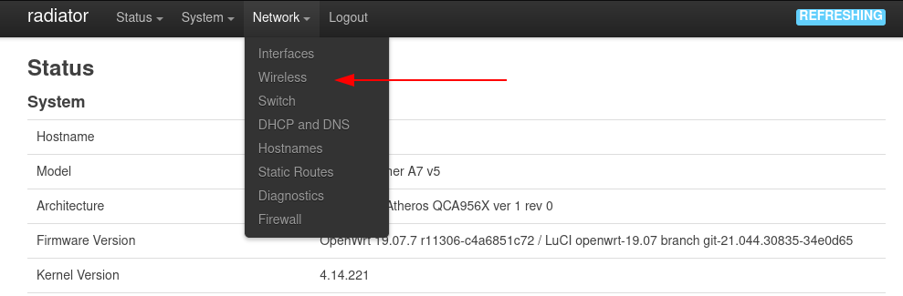

Nach der Installation von [OpenWrt](https://openwrt.org/) auf dem TP-Link Archer A7 soll das Gerät nun dazu eingesetzt werden, das WLAN zu erweitern.

Noch ein kurzer Absatz zum Gerät selbst. Eigentlich ist das Gerät schon älter. Es wurde 2013 vorgestellt, jedoch genügt es bis heute vielen Ansprüchen. Mit genügend Flash- und Arbeitsspeicher, sowie einem [Qualcomm Atheros](https://en.wikipedia.org/wiki/Qualcomm_Atheros) WLAN Chip eignet er sich sehr gut als vielfältig einsetzbares Gerät, wenn das Betriebssystem mit OpenWRT ersetzt wurde.

Zudem hat der Archer A7 es einen eineiigen Zwilling der sich Archer C7 nennt. [Laut TP-Link](https://community.tp-link.com/us/home/forum/topic/216136) sind die Geräte wirklich baugleich:

> Both are the same, the A7 is mainly found on online retailers where the C7 is usually at brick and mortar business.

## Erweiterung des WLANs

Die Absicht ist es, nicht das WLAN-Signal zu empfangen und weiterzusenden, sondern über den WAN-Port den Archer A7 in das bestehende Netz, worin sich auch das WLAN befindet via Kabel einzubinden und dann einen Access Point anzubieten.

WLAN Clients wählen meistens automatisch das stärkere und bessere Netz, wenn die SSID, Verschlüsselung und der Schlüssel gleich sind. Die Krux an der Sache ist, dass ein Angreifer, wenn er einmal den Schlüssel erbeutet hat, den Access Point klonen kann und so Man in the Middle Angriffe fahren kann. Dies bekommt ein Teilnehmer eines WLANs kaum mit.

Damit dies funktioniert muss der Router selbst ein DHCP-Client im Netz des originalen WLANs sein:

In den `Wireless` Einstellungen müssen demnach zwei (2.4GHz und 5GHz) neue WLAN-Netze mit den selben Angaben wie beim bestehenden Netz erstellt werden.

In den `Interface` Einstellungen wird nun anstatt `lan` das `wan` Netz ausgewählt. Damit bekommen die Gäste im erweiterten WLAN ebenfalls Zugriff auf den DHCP-Dienst im originalen WLAN-Netz.

Schon nach kurzer Zeit sollten erste Gäste, welche sich nahe am neuen Access Point befinden in der Liste auftauchen.
