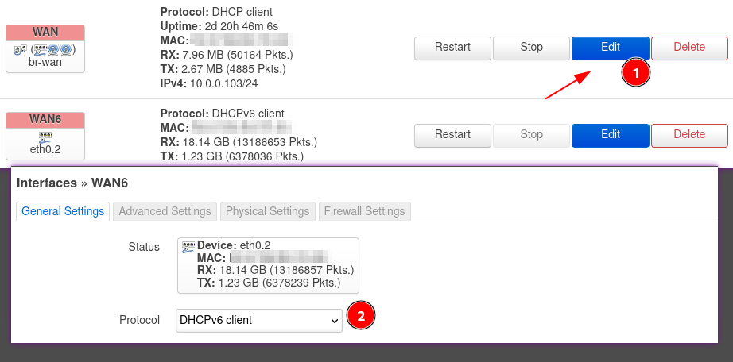

After installing [OpenWrt](https://openwrt.org/) on the TP-Link Archer A7, the device is now to be used to extend the WLAN.

Another short paragraph about the device itself. Actually, the device isn't new on the market. It was introduced in 2013, but it still meets many demands today. With enough flash and RAM, as well as a [Qualcomm Atheros](https://en.wikipedia.org/wiki/Qualcomm_Atheros) WLAN chip, it is very well suited as a versatile device when the operating system has been replaced with OpenWRT.

In addition, the Archer A7 it has an identical twin called the Archer C7. [According to TP-Link](https://community.tp-link.com/us/home/forum/topic/216136) the devices are really identical:

> Both are the same, the A7 is mainly found on online retailers where the C7 is usually at brick and mortar business.

## Extension of the WLAN

The intention is not to receive and forward the WLAN signal, but to integrate the Archer A7 via the WAN port into the existing network, where the WLAN is also located via cable, and then offer an access point.

WLAN clients usually automatically choose the stronger and better network if the SSID, encryption and key are the same. The crux of the matter is that once an attacker has captured the key, he can clone the access point and thus launch man-in-the-middle attacks. A participant in a WLAN hardly notices this.

For this to work, the router itself must be a DHCP client in the network of the original WLAN:

So in the `Wireless` settings you have to create two (2.4GHz and 5GHz) new WLAN networks with the same specifications as for the existing network.

In the `interface` settings the `wan` network is now selected instead of `lan`. This way the guests in the extended WLAN also get access to the DHCP service in the original WLAN network.

After a short time the first guests which are close to the new access point should appear in the list.
