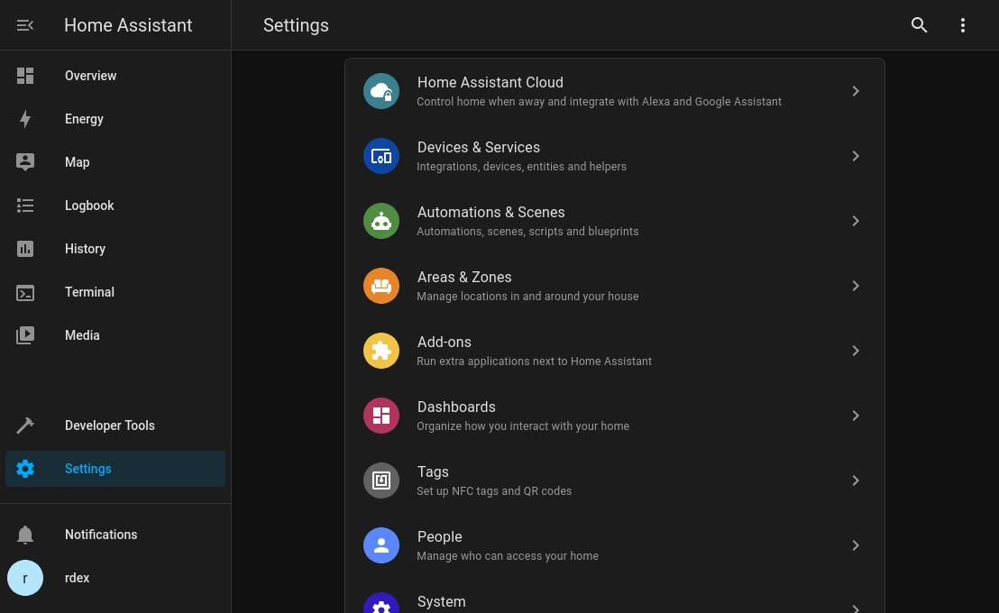

With the [RaspBee II](https://phoscon.de/en/raspbee2) you get a complete and robust Zigbee Gateway. It can be easily mounted on normally sized Raspberry Pis and is featuring a Real Time Clock (RTC), which becomes really important, when the host is not connected to the Internet at all times.

In this blog post I describe how I set up RaspBee 2 on a Raspberry Pi 4 and Home Assistant OS. I choose to install Home Assistant with the operating system method, because it is the easiest to maintain, but it is not as flexible as the operating system cannot be customized. On Home Assistants website [all methods are described](https://www.home-assistant.io/installation#compare-installation-methods).


## Enable and configure UART, i2c and RTC

Luckily all necessary kernel modules are included in the Home Assistant OS. The [official installation guide from Phoscon](https://phoscon.de/en/raspbee2/install#rtc-installation) cannot be followed, as the Home Assistant OS should not be customized. For enabling the RaspBee II HAT, it is necessary to adjust the `config.txt`, which configures the Raspberry Pi at boot. Basically you can dig out the memory card from the Pi, mount it on your computer and change the configuration file this way, but this is not very convenient. So I'm accessing the Pi via SSH. How that can be configured is described [here](https://developers.home-assistant.io/docs/operating-system/debugging/). After connecting to Home Assistant installation the `config.txt` can be changed with `vi /mnt/boot/config.txt`.

The `Makefile` of the official RaspBee II RTC installation reveals that the module `rtc_pcf85063` should be loaded. Besides that, UART and I2C should be enabled. For having Bluetooth working simultaneously with the UART, the `miniuart-bt` overlay is needed. All this can be done by adding the following lines to the `config.txt`:

```
enable_uart=1
dtparam=i2c_arm=on
dtparam=i2c_vc=on
dtoverlay=miniuart-bt
dtoverlay=i2c-rtc,pcf85063
```

A reboot later, the debug messages `dmesg` should reveal that the HATs RTC became available. `hwclock -r` should return the correct UTC time. With this successfully confirming that the RaspBee II is ready to be configured, it's time to dive into Home Assistant.

## Set up RaspBee II in Home Assistant

There are a few different methods to use the RaspBee II together with Home Assistant. Not all devices are compatible with each Zigbee integration. An extensive list about this compatibility can be found [here](https://zigbee.blakadder.com/). The RaspBee II can be integrated via [deCONZ](https://www.home-assistant.io/integrations/deconz/), [ZHA](https://www.home-assistant.io/integrations/zha/) and [Zigbee2MQTT](https://www.zigbee2mqtt.io/guide/usage/integrations/home_assistant.html). I prefer ZHA, because it is the native Home Assistant integration of Zigbee, what promises to work the best. Also it integrates nicely into the user interface of Home Assistant, whereas deCONZ brings its own look and feel.

Log into Home Assistant and navigate via `Settings` to `Devices & Services`.



Add a new integration and search for `Zigbee Home Automation` and select `/dev/ttyAMA0` as the Serial Device Path.


After loading a while, it should show you a dialog to select the Radio Type, which in this case is a `deCONZ = dresden elektronik deCONZ protocol: ConBee I/II, RaspBee I/II`.


Now we have to specify the Serial Device Path, which stays the same. To finish the setup of the new Zigbee Coordinator (RaspBee II) it should be assigned to the designated area.

With this everything is ready to pair some Zigbee devices.
