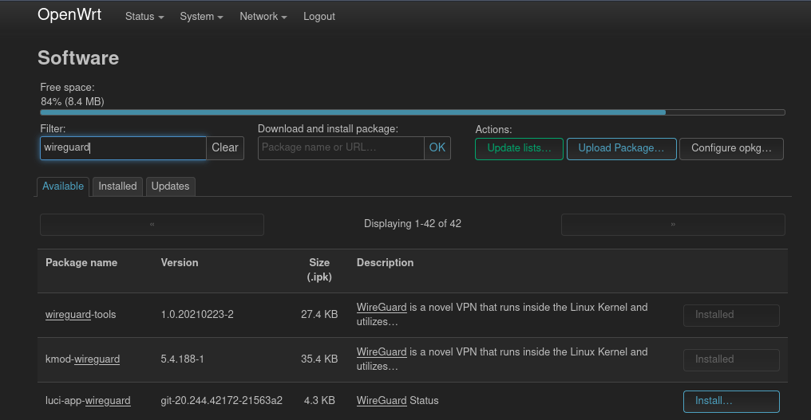
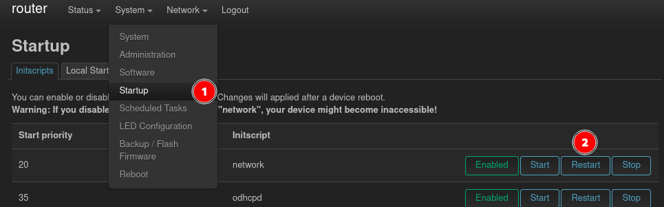
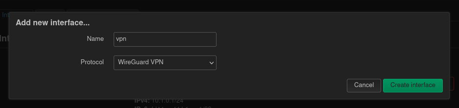
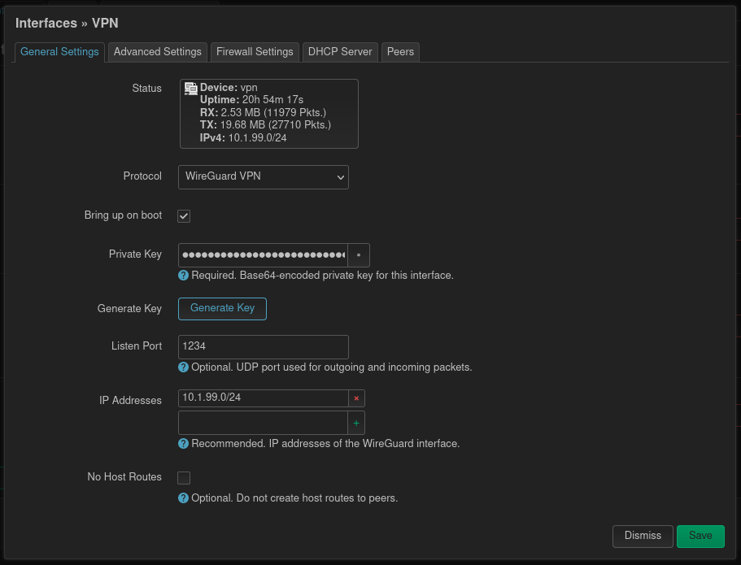
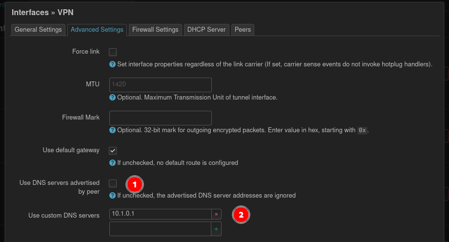
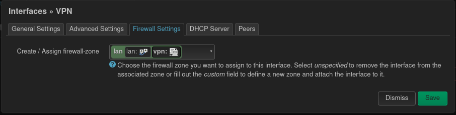
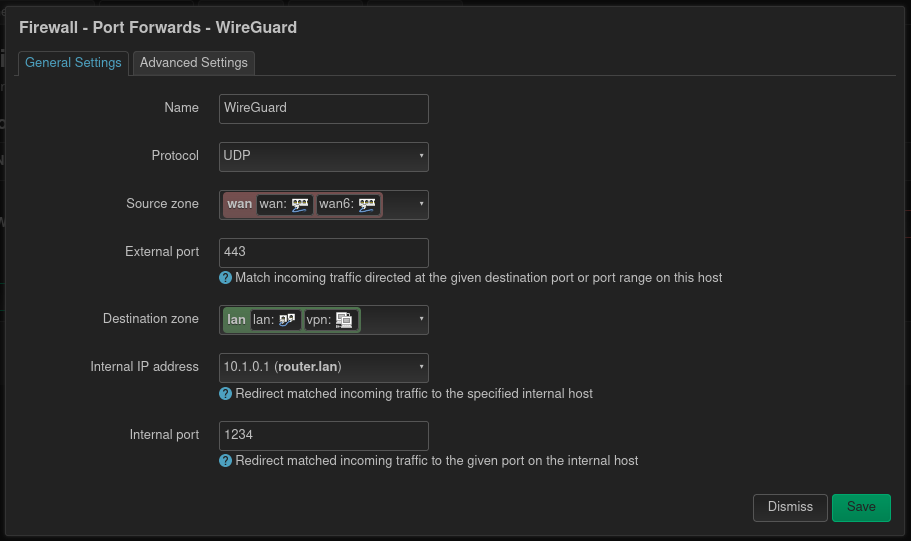
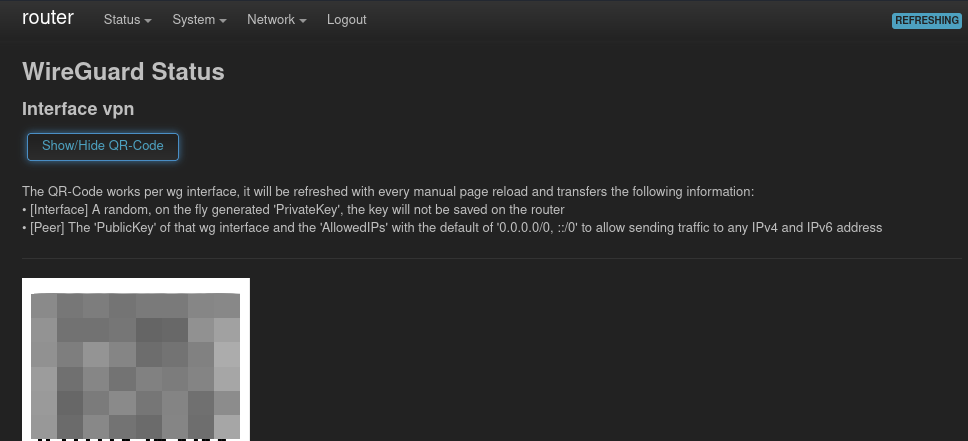
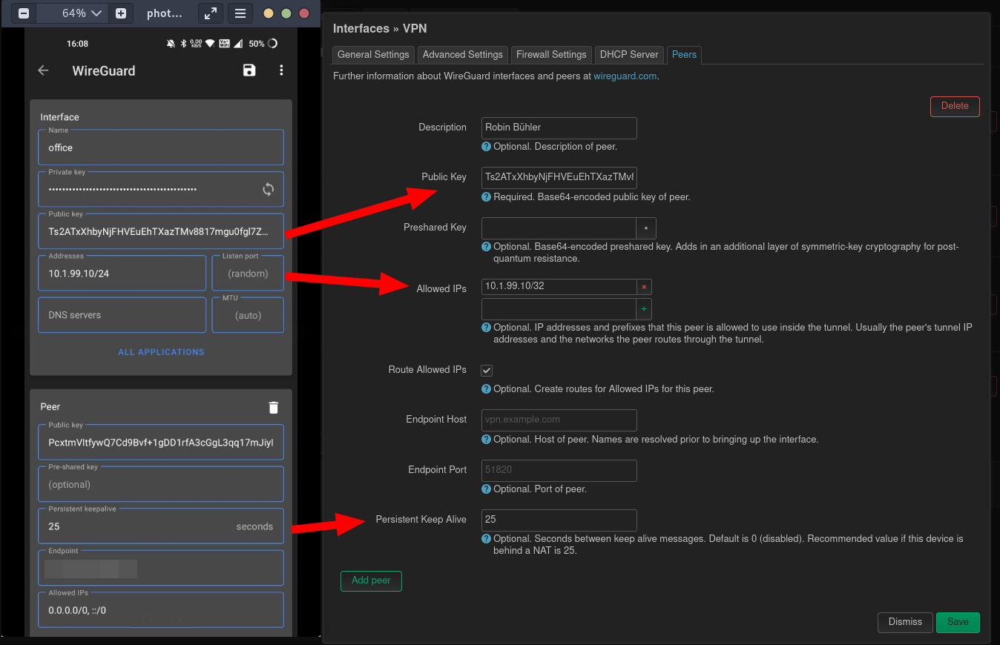

Wireguard offers a modern virtual private network (VPN) implementation, which was with [version 5.6](https://www.phoronix.com/review/linux-56-features) incorporated into the Linux kernel. It can be easily set up on a OpenWrt router, server or client wise. The following covers the steps for setting it up as a server. OpenWrts Wiki contains [this](https://openwrt.org/docs/guide-user/services/vpn/wireguard/basics) page, which has some hints, but isn't that elaborative about it.

## Install packages

After login in into OpenWrts administrator interface LuCI the packages `luci-proto-wireguard` and `luci-app-wireguard` need to be installed. The first one adds the possibility to configure Wireguard interfaces. For `luci-app-wireguard` a language package needs to be installed as well, otherwise the `Wireguard` page won't show up in the `Status` menu. This page contains some status information about the current Wireguard "situation". In my case I've installed `luci-i18n-wireguard-en`. Furthermore if you want that the QR Code is displayed on the `Wireguard` page, install the package `qrencode` as well. The installation of the mentioned packages can be done via the main menu `System` and its entry `Software`.

## Configure the Wireguard interface

To be able to configure the Wireguard interface the network service needs to be restarted, after the packages are installed, so it picks up the newly installed protocol from `lucy-proto-wireguard`. This can be done via the `Startup` page in the `System` menu. There you find the `network` service, which should be restarted.

Now it's time to create a new network interface for the VPN. A new interface can be created with the button at the bottom on the `Network / Interfaces` page. First a name for the interface should be picked. `vpn0` or `wg0` does the job. For the protocol `Wireguard VPN` is chosen.

In the next form, the private key, from which the peers public keys will be derived, can be generated by clicking the button under the field. The internal port we set to `1234` or something else, which is not used by router. Last but not least the IP network of this interface should be configured.

Change to the `Advanced Settings` at the top. It's a good idea to define a fixed DNS server, so this doesn't need to be configured on the peers (clients). If there is no separate DNS server, it's sufficient to provide the routers IP address.

For the `Firewall Settings`, the question needs to be asked, with whom VPN clients are allowed to communicate? If the clients can communicate with other clients on the local area network select `LAN` and if the vpn acts as a internet proxy `WAN` can be selected. Maybe other configurations make sense here.

## Configure port forwarding

After saving and applying the new Wireguard interface, it's time to set up a port forwarding rule on the firewall. This page can be found under `Network` and then `Firewall`. As in most public networks not all ports are permitted, I usually choose `443` as this is usually open for HTTPS traffic. For even better result, Wireguard should be configured to use TCP instead of UDP.

This means the external port can be set to `443` and the internal to the port, where Wireguard is running on. The internal IP address also points to the device, where Wireguard is installed, which is in this case the router itself.

## Add peers (clients)

Finally it's time to add some peers. On the `Wireguard` page which can be opened through the `Status` menu, there should a QR Code be shown. The official Wireguard smartphone apps can scan this code.

After scanning this code you will be asked, how the tunnel should be named. Set a static internal IP address for this peer. If the Wireguard server is behind a NAT, what is very often the case, set the `Persistent Keepalive` to `25`. Set the `Endpoint` to the WAN (public internet IP) of the router where the Wireguard server is installed.

With the public key and the other information this peer can now permitted to access the Wireguard server. In the previously created Wireguard interface (`Network` menu and `Interfaces`, then `Edit`), a new peer should be created with the public key from the peer.

With this all the configuration is done and the testing with the first peer can begin.
