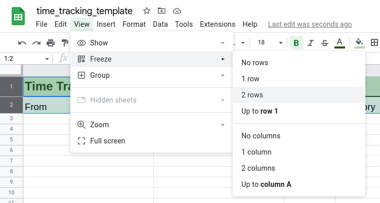

There are plenty of time tracking tools out there. I even developed my own a while ago [Timelet](https://app.timelet.org/). Anyway I often run into the situation, where I need to track my time quickly, without setting up a project in a tool, the customer wants to access it or they have some special requirements of information, which should be tracked along.

So the goal is to create a time tracking template for Google Sheets, which also helps with tracking costs and payments.

## Setting up the document

First of all, in the header row the project title should be written. Below this the column headers are added. The first two columns are frozen, which helps to keep the overview with the columns, when scrolling down.



The column headers are defined with the following purpose and data type:

- **From**: representing the start time of the time record as `Date time`.
- **To**: representing the end time of the time record as `Date time`.
- **Duration**: representing calculated duration as `Duration`.
- **Category**: describing the main purpose of the time record.
- **Description**: describing individually what was done during this time.
- **Costs**: showing the costs for the time record as `Currency`.
- **Billed?**: tracking if the time record has been billed to the customer.
- **Paid?**: tracking if the time record has been payed by the customer.

The data types are applied by selecting the whole columns except the header rows and choosing the right data type via `Format` and `Number`.

For the `Billed?` and `Payed?` columns tick boxes are inserted. The tick boxes can be found in the `Insert` menu almost at the bottom. This can be done, by selecting the whole columns and deselecting the header cells by clicking on them while holding the <kbd>CTRL</kbd> key.

On a second sheet all the configuration values like the `Categories` or the `Hourly Rate` are put. For the `Category` column a `Data Validation` rule is added via the menu `Data` and `Data validation`. This helps the user to select the category set in the setting from a drop down menu.

## Adding a button to clock in or out

Now the fun part begins. With a button the user should be able to append a new time tracking row with the current date and time or finish one. A button can be created as a drawing, which is insert from the `Insert` menu and `Drawing` item.

By clicking on the three dots, when the drawing is selected, a script can be assigned. I've named it `clockInOrOut`. Via the `Extension` and `Apps Script` a new function is added with the same name. The script adds a start time and if there is a line, which has already a start time, it sets its end time.

```js
function clockInOrOut() {
  const sheet = SpreadsheetApp.getActiveSheet();
  const nextOutCell = sheet.getRange('B1').getNextDataCell(SpreadsheetApp.Direction.DOWN).offset(1, 0);
  const nextInCell = nextOutCell.offset(0, -1);
  if(nextInCell.isBlank()) {
    nextInCell.setValue(new Date());
  } else {
    nextOutCell.setValue(new Date());
  }
}
```

## Using formulas to complete the template

Entries in the _duration_ column are calculated from the values in the from and to columns. By adding `=B3-A3` to the third row, selecting all the other rows in this column except the header rows and pressing <kbd>CTRL</kbd>+<kbd>D</kbd> the desired duration will be calculated for all data rows.

With adding the formula `=((HOUR(C3)+1/60*MINUTE(C3)+1/60/60*SECOND(C3))*Settings!$B$3)` to the first cost data cell and copy it to all following cells, the total cost per time entry is calculated. The `$` signs are used to keep exactly this one cell referenced, when coping the formula to the other cells. `Settings!$B$3` references the hourly rate.

For evaluations its interesting to know the totals. These can be calculated with the following formulas:

- **Total duration**: `=SUM('Time Tracking'!C:C)`
- **Total costs**: `=SUM('Time Tracking'!F:F)`
- **Total unbilled**: `=SUMIF('Time Tracking'!G:G,FALSE,'Time Tracking'!F:F)`
- **Total unpaid**: `=SUMIF('Time Tracking'!H:H,FALSE,'Time Tracking'!F:F)`

## Using the time tracking template

The template can be copied with [this link](https://docs.google.com/spreadsheets/d/1L4FJwxiOyzNDi-Mj0x8kk-bsy6Au4JQScu55bkTkeX0/edit). When I start a new project I copy the template, enter the name, as well as filling out the settings. Let me know, if you like it and what you would change.
