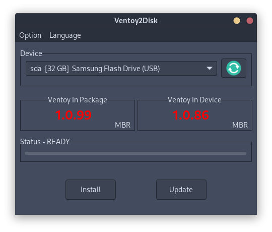

[Ventoy](https://www.ventoy.net) helps to make system images like ISO bootable from a USB drive. After you have installed Ventoy on a USB drive, it is as easy as copy ISO files to the mounted USB drive and you are ready to go.

## Installing on a USB drive

The tool offers graphical interfaces for Windows and Linux, as well as a CLI and a web interface. Via the download page individual packages can be loaded.

Inside the extracted folder, are multiple Shell Scripts, as well as binaries for multiple system architectures. With `uname -m` the used system architecture can be found out. From Gnome Nautilus the binaries can be run by double clicking them.

Ventoy usually detect plugged in USB drives automatically. Make sure you select the intended one, **as the installation is destructive to the data stored on the drive.**

## Using the bootable USB drive

After having Ventoy successfully installed on the USB drive, you can just copy ISO (and a few other formats) to your USB drive. Plug in the USB drive and boot from USB. Sometimes you need to enable this feature in the BIOS first. Some devices also offer to press a key like <kbd>F12</kbd> during the first few seconds of booting to enter a menu, where you can select the boot device.

## Useful ISO images

I would say a well equipped bootable USB drive is a must have for computer nerds away from home. In my opinion the following images can be useful to bring along:

- **Repair and rescue systems**: Whether you use ArchLinux, Windows or another operating system, it is always good to have a copy of its installation media with you. In case something terribly breaks and you cannot boot anymore, this can be a life saver.
  - ArchLinux: https://archlinux.org/download
  - Windows (Hiren's BootCD): https://www.hirensbootcd.org
- **Virus and malware control**: Who doesn't know the situation. Your parents invite you for a peaceful Sunday lunch and before cafe and dessert, Mum announces that their computer is behaving strangely. Usually this happens alternating with printer problems. So it's great to have a LiveCD with some antivirus with you to become the hero of the day.
  - Avira Rescue System: https://www.avira.com/de/downloads#tab_a3_0
- **Backup and preservation**: If you need to backup or clone a whole disk https://clonezilla.org becomes useful.
- **Forensic, security testing and privacy**: You never know, when you need to investigate something.
  - Tails for privacy: https://tails.net
  - Kali for penetration testing: https://www.kali.org
