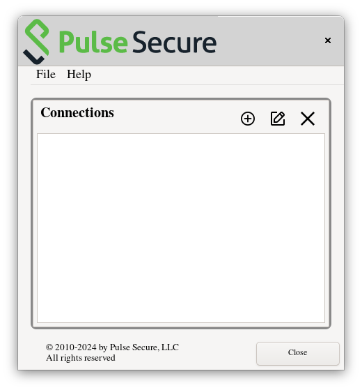
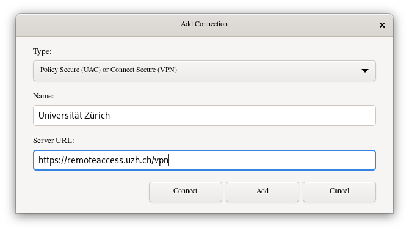
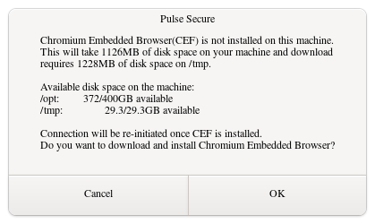
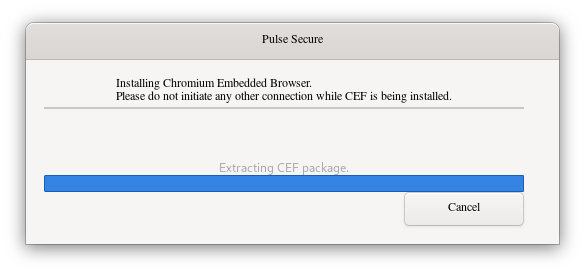
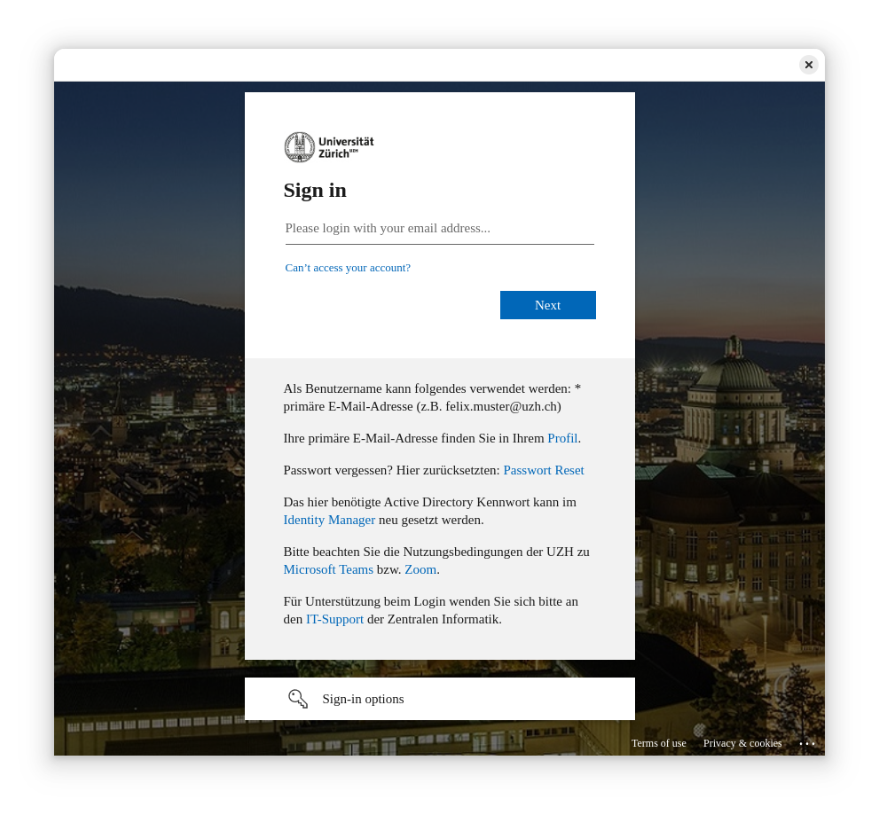

The University of Zurich uses Ivantis Pulse Secure in combination with Microsoft Single Sign On (SSO) as their VPN technology. I want to explain here how to connect this VPN when using Arch Linux.

## Summary

1. Install the packages `paru -S pulse-secure gtkmm3 webkit2gtk`.
1. Start the service `systemctl start pulse-secure`.
1. Start application with launcher `pulseui`.
1. Add a connection
1. Connect and possibly install the Chrome Embedded Framework (CEF)

## Installation

Fortunately, there is a suitable package in the Arch User Repository (AUR) called [`pulse-secure`](https://aur.archlinux.org/packages/pulse-secure). I'm using [Paru](https://github.com/Morganamilo/paru) as my AUR helper, so I installed the package using:

```bash
paru -S pulse-secure
```

If you want to use the Pulse user interface, you also need to install `gtkmm3` and `webkit2gtk` with:

```bash
paru -S gtkmm3 webkit2gtk
```

## Usage

Since the package already prompts you after installation, the user interface `pulseUi` needs a service to run.

```txt
==> NOTE: From 9.1r10.0, the client (pulseUi, pulselauncher) requires a service called pulsesecure.
==> NOTE: Run 'sudo systemctl start pulsesecure' before you run the client.
==> NOTE: Run 'sudo systemctl enable pulsesecure' to start the service automatically in boot.
```

I usually just start the service before connecting to the VPN using the GUI with `systemctl start pulsesecure`. After the service is up and running, I start `pulseui` from the application launcher.



Then I simply add a new connection, with the details provided by the organization and click the connect button.



If the VPN site requires you to log into a web based SSO, you are maybe prompted to install the Chrome Embedded Framework (CEF), which is used to display the SSO.




After installing CEF, the SSO should open and you can log in with your personal credentials.



After successful login you should be connected to the VPN.

