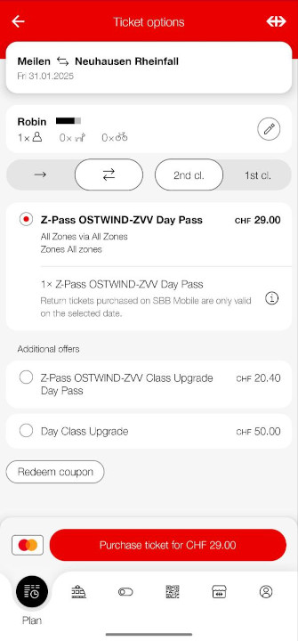

We are already at the end of January. Time flies. Here are my gems of the month.

## Technology

### Sign Git commits with GPG

Recently I wanted to use a GPG key to sign my git commits. I didn't know the steps
from the top of my head so I want to write it down here.

1. Generate a key
1. Import the key into your local keychain
1. Set the intendet key fingerprint to `user.signing` via `git config --global user.signing 7F8...`
1. Enable commit signing with `git config --global commit.gpgsign true`
1. Export the public key `gpg --output public.pgp --armor --export r@example.com`
1. Import the public key at Github, Gitlab, ...

### Send emails with Curl

Sometimes you quickly want to test if your email server is working. This can be easily done with curl. First create an email file `email.txt` with the following content:

```txt
From: John Smith <r@example.com>
To: Joe Smith <r@example.com>
Subject: an example.com example email
Date: Mon, 28 Jan 2025 17:55:16

Dear Joe,
Welcome to this example email. What a lovely day.
```

For example, you can send this email with the following command:

```bash
curl --ssl-reqd smtps://example.com --mail-from r@example.com \
     --mail-rcpt r@example.com --upload-file email.txt \
     --user 'user:password'
```

This is also documented [here](https://everything.curl.dev/usingcurl/smtp.html).

### Forgejo/Gitea: Send email notifications only on mention

By default Forgejo/Gitea sends emails notifications on every action. This can be annoying and if there are many users it can also be a lot of emails.

To only send emails on mention, you can set the following configuration in the `app.ini`:

```ini
[admin]
DEFAULT_EMAIL_NOTIFICATIONS = onmention
```

To update existing users, you can run the following SQL query:

```sql
UPDATE public.user SET email_notifications_preference = 'onmention';
```

### Break out from a locked SSH session

Sometimes you are in a locked SSH session and you can't exit. You can try the following key combination:

<kbd>Enter</kbd> then <kbd>~</kbd> and <kbd>.</kbd>

To print the escape character, you can also use the following key combination:

<kbd>Enter</kbd> then <kbd>~</kbd> and <kbd>?</kbd>

This will result in the following output:

```txt
Supported escape sequences:
 ~.   - terminate connection (and any multiplexed sessions)
 ~B   - send a BREAK to the remote system
 ~R   - request rekey
 ~V/v - decrease/increase verbosity (LogLevel)
 ~^Z  - suspend ssh
 ~#   - list forwarded connections
 ~&   - background ssh (when waiting for connections to terminate)
 ~?   - this message
 ~~   - send the escape character by typing it twice
(Note that escapes are only recognized immediately after newline.)
```

## Other

### SBB: Offered tickets are not always the cheapest option

I recently noticed that the SBB app does not always offer the cheapest ticket. For example when you want to travel from Meilen to the Rhine Fall, the app offers a ticket for CHF 29.00. It includes all public transport in the cantons of Zurich and Schaffhausen for a whole day. However, if you buy a 9 o'clock pass for CHF 13.50 and a ticket from Rafz to the Rhine Fall and back for CHF 10.00, you pay only CHF 23.50. You also get an all day ticket on this track. This is CHF 5.50 or ~19% cheaper. I think the app should show the cheapest option first.


