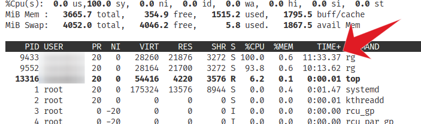

Another month went by. Here are my gems of the month.

## Technology

### Compress PDFs with Ghostscript

Compressing PDFs isn't a simple task, because it's a complex format with different medias embedded. Ghostscript is a powerful tool to manipulate PDFs.

Via the `PDFSETTINGS` parameter, you can set the compression level. This is documented [here](https://ghostscript.readthedocs.io/en/latest/VectorDevices.html#controls-and-features-specific-to-postscript-and-pdf-input).

Here is an example to compress a `input.pdf` to `output.pdf`:

```bash
gs -sDEVICE=pdfwrite -dCompatibilityLevel=1.4 -dPDFSETTINGS=/ebook -dNOPAUSE -dQUIET -dBATCH -sOutputFile=output.pdf input.pdf
```

According to [this](https://askubuntu.com/a/256449) post the options are:

 - `-dPDFSETTINGS=/screen` lower quality, smaller size. (72 dpi)
 - `-dPDFSETTINGS=/ebook` for better quality, but slightly larger pdfs. (150 dpi)
 - `-dPDFSETTINGS=/prepress` output similar to Acrobat Distiller "Prepress Optimized" setting (300 dpi)
 - `-dPDFSETTINGS=/printer` selects output similar to the Acrobat Distiller "Print Optimized" setting (300 dpi)
 - `-dPDFSETTINGS=/default` selects output intended to be useful across a wide variety of uses, possibly at the expense of a larger output file


### VSCode on remote RedHat server causes issues

When connecting to a remote server, VS Code tries to index the file system. Something goes wrong with that on RedHat devices, because it endlessly loops through some commonly found symlinks.



To disable this switch the following setting off:

`search.followSymlinks`

