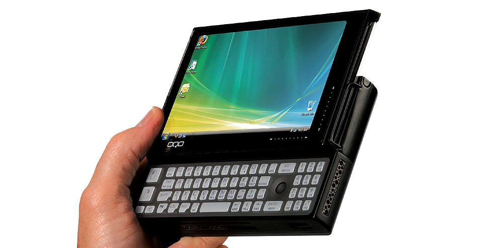
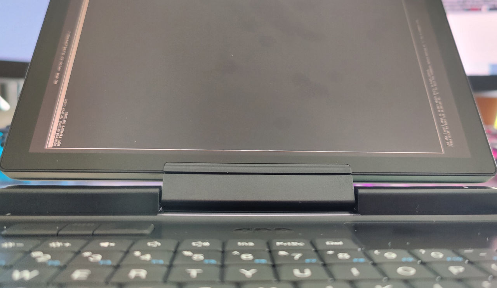

Since I was a child, small computers fascinated me. I remember playing with my dads Psion Revo. It fascinated me how much you could do with such a small device. A whole ecosystem of apps to explore, as well as programming it yourself or using the office tools that came with it.



About ten years later ultra mobile PCs (UMPCs) became a thing. I remember reading about one made by a company called OQO. It had a slide-out keyboard, ran Windows and was about 5 inch small. It looked cool, when McGee in the tv show NCIS used one. Oh, I wished to have one of those, but they were expensive and had to be imported from the US.

Fast forward another five ten years, I finally got my hands on an UMPC. A GPD MicroPC 2 arrived last week.

## Preparation

Of course I wanted to try it out as quickly as possible, so I start up the pre installed Windows 11. It was useful to update the firmware of the device. After extracting the product key, I plugged in my USB stick with Ventoy and a Arch Linux ISO. I booted into the Arch Linux live system by pressing (<kbd>FN</kbd> +) <kbd>F7</kbd> and started the installation.

The product key can be found in the registry at `Computer\HKEY_LOCAL_MACHINE\SOFTWARE\Microsoft\Windows NT\CurrentVersion\SoftwareProtectionPlatform` in the `BackupProductKeyDefault` entry.

## Installation

I followed more or less my notes from my [previous installations](/notes/tools/workstation). Accessing the installation via SSH was very handy, because the device is really quite small and typing so many commands on the tiny keyboard is not very comfortable.

### Rotated display

Also it displayed everything 90 degrees rotated, which can be fixed with some kernel parameters. In my GRUB configuration I set `GRUB_CMDLINE_LINUX_DEFAULT="loglevel=3 quiet fbcon=rotate:1 video=DSI-1:panel_orientation=right_side_up"` to rotate the display to the correct orientation.

Unfortunately GRUB doesn't support rotating the display, but at least the rest is displayed correctly.



### Touchscreen

Unfortunately the Touchscreen doesn't work after sleep. The Arch Wiki provides a fix:

> BIOS 2.16 or later is needed for it to work on Linux.

> Currently the touchscreen will turn off when you wake the laptop from sleep, but not turn back on when awaken. This can be fixed by running the following:

```bash
echo -n "i2c-ILTP7807:00" > /sys/bus/i2c/drivers/i2c_hid_acpi/unbind
echo -n "i2c-ILTP7807:00" > /sys/bus/i2c/drivers/i2c_hid_acpi/bind
```

As this needs to be exectued after every resume, I created a systemd service `/etc/systemd/system/touchscreen-resume.service`:

```ini
[Unit]
Description=Rebind i2c_hid device after resume
After=suspend.target
After=hibernate.target
After=hybrid-sleep.target

[Service]
Type=oneshot
ExecStart=/bin/sh -c 'echo -n "i2c-ILTP7807:00" > /sys/bus/i2c/drivers/i2c_hid_acpi/unbind && echo -n "i2c-ILTP7807:00" > /sys/bus/i2c/drivers/i2c_hid_acpi/bind'

[Install]
WantedBy=suspend.target
WantedBy=hibernate.target
WantedBy=hybrid-sleep.target
```

Then you need to enable it with by running:

```bash
systemctl daemon-reexec
systemctl enable touchscreen-resume.service
```

### Right button

There is a quirk needed to make the right button of the touchpad get to work. As the Arch Wiki states:

> The right mouse button can be fixed by adding a quirk to libinput in `/etc/libinput/local-overrides.quirks`:

```ini
[ALPS touchpad with external buttons]
    MatchName=ALPS0001:00 36B6:C001 Touchpad
    MatchUdevType=touchpad
    MatchDMIModalias=dmi:*svnGPD:pnG1688-08:*
    # Drop the "buttonpad" property so libinput treats it as a normal touchpad
    AttrInputProp=-INPUT_PROP_BUTTONPAD
```

## More information

If you want to get your own GPD MicroPC 2, you can currently order it from [Indiegogo](https://www.indiegogo.com/projects/gpd-micropc-2-multi-port-mobile-productivity-tool). For everybody planing to install Arch Linux on it, the great Arch Wiki already has a [dedicated page](https://wiki.archlinux.org/title/GPD_MicroPC_2).
