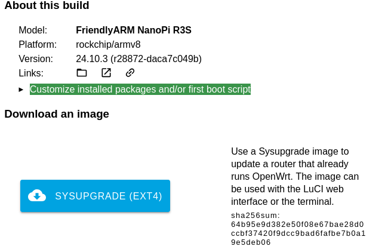
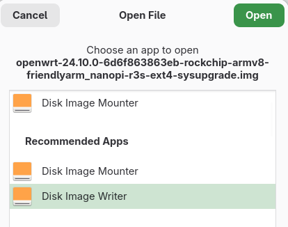

The NanoPi R3S by FriendlyElec is a small and affordable single-board computer with two NICs, making it suitable for use as a router on your desk. It is available for about 35 CHF on AliExpress. You can get it with up to 2GB of RAM and 32GB of eMMC storage. Also, it can be packed up into a neat metal case.

Preinstalled is FriendlyWRT, a fork of OpenWRT. However, I wanted to install the official OpenWRT firmware to get the latest features and security updates.

## Preparation

The most convenient way for me to install OpenWRT was to use an SD/TF card and then flash the eMMC from there. There are other options, like using the USB interface. All are described on [the official wiki page](https://wiki.friendlyelec.com/wiki/index.php/NanoPi_R3S).

1. First, I downloaded the latest and suitable ext4 image via the [OpenWRT Firmware Selector](https://firmware-selector.openwrt.org) (choose "FriendlyARM NanoPi R3S").
   - Usually, it's more advisable to use a SquashFS (with an overlay) for a router. Changes are not persistent in the SquashFS, which results in safer firmware upgrades, system compression, and other benefits. I chose ext4, so it's easier to tinker around by directly writing changes to the system.
   - I used the service to custom-build an image including Luci (the web interface of OpenWRT). This is sometimes handy because the standard images are very minimal. <br> 
2. On my work machine, I extracted the archive and flashed it with Gnome's Disk Image Writer. If you are on Windows, I can recommend you [Rufus](https://rufus.ie/en/) to do so. <br> 
3. Then I inserted the TF card into the little router, connected my laptop to the LAN port, and powered it up by plugging in a USB C cable.
4. By default, the computer should be assigned an address by DHCP when you are connected to the LAN port. The router is reachable at the default gateway on `192.168.1.1`.

## Flash OpenWRT to the internal eMMC storage

Because of the many benefits of the eMMC storage over a TF card, like wear-leveling and faster access and read/write times, I used the installation on the TF card to flash the eMMC storage with OpenWRT as follows:

1. After the device was successfully booted up, I sent the same image to the router's `/tmp` with:
   ```bash
   scp -O ~/Downloads/openwrt-24.10.0-6d6f863863eb-rockchip-armv8-friendlyarm_nanopi-r3s-ext4-sysupgrade.img root@192.168.1.1:/tmp
   ```
   - The `-O` parameter lets you use the legacy file transfer mode of `scp` instead of the more secure `sftp` default mode. `sftp` is not supported by the SSH server (dropbear) used by OpenWRT.
2. Connect via SSH `ssh root@192.168.1.1` and flash the image to the eMMC storage with:
   ```bash
   dd if=/tmp/openwrt-24.10.0-6d6f863863eb-rockchip-armv8-friendlyarm_nanopi-r3s-ext4-sysupgrade.img of=/dev/mmcblk0 bs=4M conv=fsync
   sync
   ```
3. Remove the TF card and reboot.

## Expand the file system

After the installation, I realized that OpenWRT didn't expand the file system. So it only used 16M for the boot partition and 104M for `/`:

```txt
Disk /dev/mmcblk0: 29.13 GiB, 31272730624 bytes, 61079552 sectors
Units: sectors of 1 * 512 = 512 bytes
Sector size (logical/physical): 512 bytes / 512 bytes
I/O size (minimum/optimal): 512 bytes / 512 bytes
Disklabel type: dos
Disk identifier: 0x5452574f

Device         Boot  Start    End Sectors  Size Id Type
/dev/mmcblk0p1 *     65536  98303   32768   16M 83 Linux
/dev/mmcblk0p2      131072 344063  212992  104M 83 Linux
```

I've followed the instructions from [this wiki page](https://openwrt.org/docs/guide-user/advanced/expand_root) to expand the root partition. This is quite complicated because OpenWRT doesn't support online resizing, and the system upgrades come with a fixed partition table. So every time the system is upgraded, the partition table has to be resized again.

<details>
<summary>The script from the wiki page</summary>

```bash
# Configure startup scripts
cat << "EOF" > /etc/uci-defaults/70-rootpt-resize
if [ ! -e /etc/rootpt-resize ] \
&& type parted > /dev/null \
&& lock -n /var/lock/root-resize
then
ROOT_BLK="$(readlink -f /sys/dev/block/"$(awk -e \
'$9=="/dev/root"{print $3}' /proc/self/mountinfo)")"
ROOT_DISK="/dev/$(basename "${ROOT_BLK%/*}")"
ROOT_PART="${ROOT_BLK##*[^0-9]}"
parted -f -s "${ROOT_DISK}" \
resizepart "${ROOT_PART}" 100%
mount_root done
touch /etc/rootpt-resize

if [ -e /boot/cmdline.txt ]
then
NEW_UUID=`blkid ${ROOT_DISK}p${ROOT_PART} | sed -n 's/.*PARTUUID="\([^"]*\)".*/\1/p'`
sed -i "s/PARTUUID=[^ ]*/PARTUUID=${NEW_UUID}/" /boot/cmdline.txt
fi

reboot
fi
exit 1
EOF
cat << "EOF" > /etc/uci-defaults/80-rootfs-resize
if [ ! -e /etc/rootfs-resize ] \
&& [ -e /etc/rootpt-resize ] \
&& type losetup > /dev/null \
&& type resize2fs > /dev/null \
&& lock -n /var/lock/root-resize
then
ROOT_BLK="$(readlink -f /sys/dev/block/"$(awk -e \
'$9=="/dev/root"{print $3}' /proc/self/mountinfo)")"
ROOT_DEV="/dev/${ROOT_BLK##*/}"
LOOP_DEV="$(awk -e '$5=="/overlay"{print $9}' \
/proc/self/mountinfo)"
if [ -z "${LOOP_DEV}" ]
then
LOOP_DEV="$(losetup -f)"
losetup "${LOOP_DEV}" "${ROOT_DEV}"
fi
resize2fs -f "${LOOP_DEV}"
mount_root done
touch /etc/rootfs-resize
reboot
fi
exit 1
EOF
cat << "EOF" >> /etc/sysupgrade.conf
/etc/uci-defaults/70-rootpt-resize
/etc/uci-defaults/80-rootfs-resize
EOF
```

</details>

<details>
<summary>The instructions from the wiki page</summary>

```bash
# Install packages
opkg update
opkg install parted losetup resize2fs blkid

# Expand root partition/filesystem
sh /etc/uci-defaults/70-rootpt-resize
```

</details>
